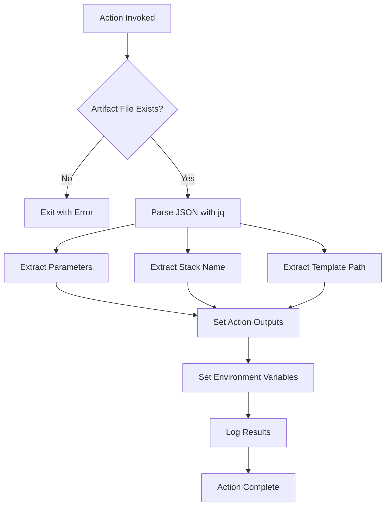

# Design Document

## Overview

The CloudFormation Parameters Reader is a GitHub composite action that extracts deployment configuration from a JSON artifact file. The action uses shell scripting with `jq` for JSON parsing and follows GitHub Actions best practices for input/output handling. It provides both action outputs and environment variables for maximum flexibility in downstream workflow steps.

## Architecture

The action follows the composite action pattern, executing a single bash script that:
1. Validates the input artifact file exists
2. Parses JSON content using `jq`
3. Extracts specific fields (parameters, stack-name, template-path)
4. Sets both GitHub Actions outputs and environment variables
5. Provides clear logging and error handling



## Components and Interfaces

### Input Interface
- **artifact-path**: Optional string input with default value `./artifacts/deployment.json`
- Follows GitHub Actions input specification with description and default value

### Output Interface
- **parameters**: Compact JSON string containing CloudFormation parameters
- **stack-name**: String containing the CloudFormation stack name
- **template-path**: String containing the path to the CloudFormation template

### Environment Variables
- **DEPLOYMENT_PARAMETERS**: Multiline format for complex JSON structures
- **DEPLOYMENT_STACK_NAME**: Single line string value
- **DEPLOYMENT_TEMPLATE_PATH**: Single line string value

### External Dependencies
- **jq**: JSON processor for parsing and extracting values
- **bash**: Shell environment for script execution
- **GitHub Actions runtime**: For input/output handling

## Data Models

### Input JSON Structure
```json
{
  "parameters": {
    "ParameterKey1": "ParameterValue1",
    "ParameterKey2": "ParameterValue2"
  },
  "stack-name": "my-cloudformation-stack",
  "template-path": "./templates/infrastructure.yaml"
}
```

### Action Metadata Structure
```yaml
name: 'CloudFormation Parameters Reader'
description: 'Reads CloudFormation deployment parameters from JSON artifact'
inputs:
  artifact-path:
    description: 'Path to the deployment.json artifact'
    required: false
    default: './artifacts/deployment.json'
outputs:
  parameters:
    description: 'CloudFormation parameters in JSON format'
  stack-name:
    description: 'CloudFormation stack name'
  template-path:
    description: 'Path to CloudFormation template'
```

## Error Handling

### File Not Found
- Check file existence before processing
- Exit with code 1 and clear error message
- Log the expected file path for debugging

### JSON Parsing Errors
- `jq` will handle malformed JSON gracefully
- Missing fields will result in null values
- Action should continue processing available fields

### Missing Required Tools
- Assume `jq` is available in GitHub Actions runners
- If `jq` is not available, the action will fail with a clear error

## Testing Strategy

### Unit Testing Approach
- Create test JSON files with various configurations
- Test with missing files to verify error handling
- Test with malformed JSON to verify graceful degradation
- Verify output format matches expected structure

### Integration Testing
- Test within actual GitHub Actions workflow
- Verify outputs are accessible in subsequent steps
- Verify environment variables are properly set
- Test with different artifact-path inputs

### Test Cases
1. **Happy Path**: Valid JSON file with all required fields
2. **Missing File**: Non-existent artifact file
3. **Malformed JSON**: Invalid JSON syntax
4. **Missing Fields**: JSON with some missing fields
5. **Custom Path**: Using non-default artifact-path input
6. **Empty Parameters**: JSON with empty parameters object

## Implementation Details

### Script Structure
The main script will follow this pattern:
1. Input validation and file existence check
2. JSON parsing and field extraction using `jq`
3. Logging extracted values for debugging
4. Setting GitHub Actions outputs using `$GITHUB_OUTPUT`
5. Setting environment variables using `$GITHUB_ENV`

### Output Format Considerations
- Parameters will be output as compact JSON (`jq -c`) for single-line compatibility
- Environment variables will use multiline format for complex JSON structures
- All string values will be properly escaped for shell safety

### Logging Strategy
- Use emoji prefixes for visual clarity (📋, ✅, ❌)
- Log all extracted values for debugging purposes
- Provide clear error messages for troubleshooting